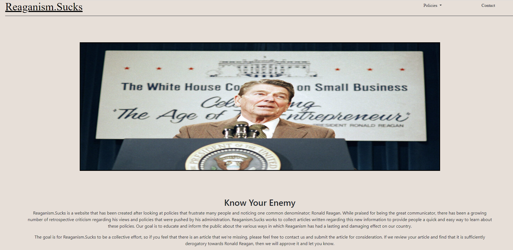

# rrdevil

## Description

A website built to consolidate as many articles about Ronald Reagan and the effects of his policies. This website is intended to be a collabrative effort, for people to find and submit potential articles. Once an article is approved and hosted on the website, they will be displayed and organized based on political category. The articles will link back to the original host of the article in order to ensure that they obtain the credit for hosting the full article.

## Table of Contents

- [Description](#Description)
- [Installation](#Installation)
- [Usage](#Usage)
- [Screenshots](#Screenshots)
- [Contributing](#Contributing)
- [Questions](#Questions)

## Installation

Install node. Install MySQL.

Run `npm install`

## Usage

Run server with `npm start`

## Screenshots

## Contributors

[Lorreina Guyett](https://www.linkedin.com/in/lorreina-guyett-261babb2/)

## Questions

If you have additional questions, please reach out using the contact information below.

## Contacts

- Lorreina Guyett
  - [Github](https://github.com/slorreina369)
  - [Email](mailto:slorreina369@gmail.com)
